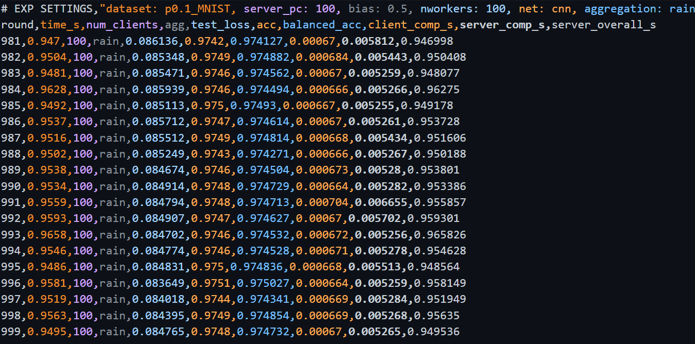

## Overview
This repository provides an anonymous research artifact to support the evaluation of the accompanying submission.
The codebase reflects a research prototype used for experimental validation and is provided for verification purposes only.

The implementation is intended to demonstrate the correctness and qualitative behavior of the proposed approach under representative settings.
It is not designed as a production-ready or fully optimized system.

## Repository Structure
An overview of the repository structure is shown below:
```bash
.
├── main.py # Entry point for running experiments
├── aggregation_rules.py # Aggregation rule implementations
├── aggregation_rules_tssc.py # Alternative aggregation variants
├── trust_sign.py # Trust and sign-based scoring logic
├── tssc_relu.py # ReLU-based weighting logic
├── attacks.py # Adversarial client behaviors
├── client_codec.py # Client-side encoding utilities
├── rain_codec.py # Update encoding and decoding logic
├── rain_hd_rpc.py # RPC-based aggregation logic
├── shuffler.py # Shuffling and anonymization logic
├── shuffle.go # Go-based shuffling component
├── utils.py # General utility functions
├── data_loaders.py # Dataset loading utilities
├── models/ # Model definitions
│ ├── lr.py # Logistic regression model
│ └── simple_cnn.py # Simple CNN model
├── data/ # Dataset loaders and cached data
│ └── mnist_like_loader.py
├── Secure-Shuffling/ # Secure shuffling implementation (Go)
│ ├── cmd/
│ ├── modp/
│ └── mycrypto/
├── requirements.txt # Python dependencies
└── README.md # This file
```
Some auxiliary files and development artifacts may also be present.
Reviewers are encouraged to focus on `main.py` and the aggregation- and shuffling-related modules for evaluation.

## Environment
The code has been tested with the following environment:
- Python >= 3.8
- PyTorch >= 1.10

Dependencies can be installed via:
```bash
pip install -r requirements.txt

Go Dependency (Optional)
The secure shuffling component is implemented in Go and is optional for minimal verification.
Go version: ≥ 1.18
This component is only required for experiments involving the secure shuffling backend.
```

## Minimal Running Example
A minimal experiment sufficient to validate the correctness and qualitative behavior of the method can be executed using the following command:

```bash
python main.py \
  --dataset MNIST \
  --net cnn \
  --nworkers 100 \
  --niter 500 \
  --batch_size 64 \
  --lr 0.02 \
  --aggregation rain \
  --gpu 1 \
 ``` 

<p align="center">
  
</p>
**Convergence of RAIN under Shuffle-DP.**  
RAIN converges smoothly and maintains stable accuracy under local noise and anonymization, illustrating robustness in the shuffle model of differential privacy.

---
This configuration runs a reduced-scale setup intended for verification purposes.
It is not intended to reproduce all experimental results or configurations reported in the paper.


## Execution Flow 
A typical execution proceeds as follows:
1. The main entry point (`main.py`) initializes the dataset, model, and experimental configuration.
2. Worker updates are generated locally according to the specified dataset and model.
3. Updates are processed by the selected aggregation strategy.
4. The aggregated result is applied to update the global model.
5. The process repeats for the specified number of iterations.


## Notes for Reviewers
This artifact is anonymized and provided solely for evaluation during the double-blind review process.
Some auxiliary files or cached data may be present but are not required for minimal verification.
This flow is intended to help reviewers navigate the codebase and understand the overall execution logic.